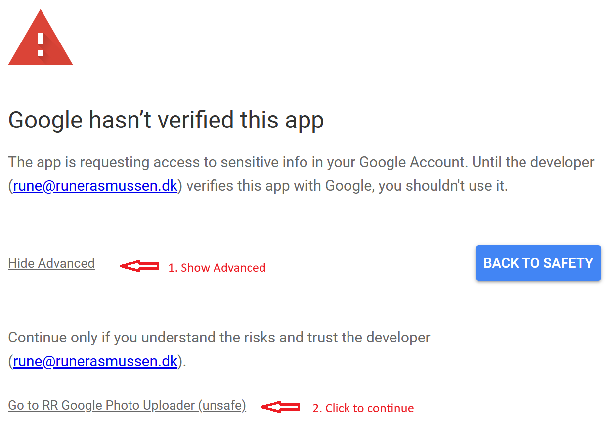

# Google Photos Permissions
The tool will ask for your permission to access your Google Photos account and will **not** share or use this access beyond your computer.

Permission Category | Used for 
------------ | -------------
View your Google Photos library | Identify if an Album already exists
View the photos, videos and albums in your Google Photos | Identify available storage space in your Google Account
Add to your Google Photos library | Create new Albums and upload Image/Movie files

## Grant Permissions
The tool will automatically ask for permission to access your Google Photos account on the first run.

As this is a hobby project the app has not gone through the Google verification process, so you will see a warning message that the app is not verified. You can safely ignore this warning and proceed with granting access.

## Revoke Permissions
To revoke the permissions you should:
1. Remove the token file '.credentials/google-photos-upload.json'.
2. Remove the tool from your list of [Apps with access to your Google account](https://myaccount.google.com/permissions)
